# Architecture Decision Record: Playback-Side Network Profiling (BBRv2 Cropped)

## 1. Background (Context)

When an end-user starts experiencing playback stutters or resolution downgrades in our live/VOD app, we immediately face a classic engineering dilemma: 
**"Is the viewer's downlink network failing, or is the upstream publisher failing to encode/send enough data?"**

This document outlines our architectural approach to answering that question. Currently, we integrate a 3rd-party Player SDK that acts as a black box. We do not have access to WebRTC's standard microsecond-level packet timestamps. Instead, the SDK gives us a callback **once every second**, providing only aggregated macro-level stats: total received bytes, an estimated RTT, jitter, and the current internal buffer length. 

We needed to design a robust Bandwidth Estimation (BWE) module to deduce the player's true network capacity using only these sparse, low-frequency data points.

## 2. Requirements

To effectively diagnose the network state under these constraints, our algorithm must meet the following technical requirements:
1.  **Isolate Upstream vs. Downlink Drop-offs (App-Limited Detection)**: If the broadcaster drops their streaming bitrate from 5Mbps to 1Mbps, we will only receive 1Mbps. We must ensure our algorithm isn't tricked into evaluating our network ceiling as 1Mbps. It must discern a truly congested pipe from an artificially empty one.
2.  **Operate on 1-Second Batches**: It must function accurately without relying on per-packet inter-arrival timings.
3.  **Passive Observation**: Since we are purely a receiver application, the algorithm cannot use active network pacing or probing (we can't just send dummy packets to check bandwidth).
4.  **Buffer Awareness**: If the player's internal buffer is near starvation, the algorithm must quickly react and signal a downgrade, overriding generalized network metrics to save the playback session.

## 3. Decision: Why a "Cropped" BBRv2 Algorithm?

Initially, we evaluated the industry standard for WebRTC: **GCC** (Google Congestion Control). However, we realized that GCC is a delay-gradient algorithm that tracks the tiny arrival time differences ($d_i - d_{i-1}$) between individual packets. When you aggregate stats into a 1-second interval, those micro-delays are completely washed out. If we used GCC, the algorithm would essentially be blind.

**Our Decision**: We decided to adopt the core philosophy of Google's **BBRv2**, but specifically tailored (or "cropped") for a passive receiver environment.

*   **Why BBRv2?** Unlike GCC, BBRv2 focuses on macro-metrics. It looks at the big picture: tracking the **maximum delivery rate (`BtlBw`)** and the **physical minimum delay (`RTprop`)** over a rolling time window. This macroscopic sliding-window approach fits perfectly with our 1-second aggregated SDK callbacks.
*   **Why we call it "Cropped"?** Standard BBR relies on state machines (like `ProbeBW`) to actively pace and push data bursts into the network. As a receiver, we cannot control sender pacing. Therefore, we "cropped out" the active pacing logic, retaining only the profound sliding-window profiler and the passive observation mechanics.

**How this solves our core problem**: 
By merging the BBRv2 sliding windows with our SDK's Jitter and RTT stats, we achieve the ability to differentiate the blame. For example, if our received throughput suddenly plummets, but our RTT remains tightly bound to its baseline and Jitter is practically zero, we confidently conclude that the internet pipe isn't congested—it's merely empty. We deduce that the player's network is perfectly fine and the upstream sender has simply stopped delivering data. In this scenario, we freeze our internal bandwidth estimate to prevent an unjustified visual downgrade for the user.

---

## 4. System Workflow (Sequence)

Before diving into the algorithm, here is how the BWE module interacts with the Player and the ABR (Adaptive Bitrate) manager.

```mermaid
sequenceDiagram
    autonumber
    participant Player as Player SDK (Receiver)
    participant PP as Signal Preprocessor
    participant Core as BWE Core (BBRv2)
    participant ABR as ABR / Decision Logic

    loop Every 1 Second
        Player->>PP: Invoke Callback: Raw NetworkSample<br/>(received_bytes, rtt, jitter, buffer_ms)
        
        rect rgb(60, 60, 60)
        note right of PP: Algorithm Execution Phase
        PP->>Core: PreprocessedSignals<br/>(Kalman smoothed RTT/Jitter)
        Player->>Core: Raw Data pass-through
        note over Core: Stage A: Delivery Rate Extracted
        note over Core: Stage B: App-Limited Check
        note over Core: Stage C: Sliding Windows Updated
        note over Core: Stage D: Safety Bounds & Penalties
        end
        
        Core-->>ABR: Output BweResult<br/>(estimated_bitrate_bps, trend)
        ABR->>Player: Adjust Video Quality / Switch Track
    end
```



---

## 5. Input Parameters

Every 1 second, the player triggers the BWE module by passing a `NetworkSample`. Additionally, a `PreprocessedSignals` object (smoothed variants of the raw signals to eliminate extreme outliers) is injected into the core updater.

### 5.1 Raw Input (`NetworkSample`)
*   **`timestamp_ms` (int64)**: Absolute monotonic timestamp of the sample. Used to calculate precise dynamic interval differentials (solving timer-drift issues).
*   **`received_bytes` (uint64)**: Total payload/media bytes received within the last interval.
*   **`rtt_ms` (double)**: Current estimated Round Trip Time to the server/CDN.
*   **`received_buffer_ms` (double)**: The player's current internal media buffer length (in milliseconds). **Critical business metric.**

### 5.2 Filtered Input (`PreprocessedSignals`)
*   **`rtt_ms` (double)**: Kalman/EMA smoothed RTT, preventing sudden solitary ICMP spikes from triggering false congestion drops.
*   **`jitter_ms` (double)**: Arrival jitter. High jitter indicates queuing or competing flows.

---

## 6. Core Architecture & Philosophy

Given the 1s interval, algorithms like GCC (Delay-Gradient based) are mathematically blind. We utilize BBR's macro components: 
**A pipeline fundamentally controlled by `BtlBw` (Max Bottleneck Bandwidth) and `RTprop` (Min Propagation Delay).**

### 6.1 The Sliding Windows

The state memory relies on two core filters maintaining the last 10 seconds of network history:
1.  **`SlidingWindowMax` (Max BW Filter)**: Records the highest `Delivery Rate` seen. As long as the network is stable, the maximum delivery rate we experience is assumed to be our physical pipe size.
2.  **`SlidingWindowMin` (Min RTT Filter)**: Recodes the lowest `rtt_ms` seen. This represents the unloaded physical distance to the CDN.

#### How the Sliding Window Queue Works
The sliding window uses a monotonically decreasing/increasing double-ended queue (Dequeue) approach to ensure time-complexity is $O(1)$. 

**Visualization of `SlidingWindowMax` (Example with a 3-second window):**

Imagine a time axis progressing horizontally. New Bandwidth (BW) samples arrive at `T1`, `T2`...

```text
Time (Tn) :    T1       T2       T3       T4       T5       T6       T7 (s)
               |        |        |        |        |        |        |
Input BW  :    500      300      800      600      200      100      100 (kbps)
               |        |        |        |        |        |        |
               v        v        v        v        v        v        v
            .-----.  .-----.  .-----.  .-----.  .-----.  .-----.  .-----.
Dequeue     |[500]|  |[500]|  |     |  |[800]|  |[800]|  |[600]|  |[200]|
State       |     |  |[300]|  |[800]|  |[600]|  |[600]|  |[200]|  |[100]|
(Monotonic) |     |  |     |  |     |  |     |  |[200]|  |[100]|  |[100]|
            '-----'  '-----'  '-----'  '-----'  '-----'  '-----'  '-----'
                                 ^                 ^        ^        ^
Action &                      (Evict           (Window 3s)  |        |
Event                         500&300)                      |        |
                                                         (800 exp) (600 exp)
-----------------------------------------------------------------------------
Output Max:    500      500      800      800      800      600      200 
```

*Note: The extreme peaks remain at the front of the queue until they slide out of the time window. When `800` expires at `T6`, the queue naturally falls back to `600`, gracefully tracking the network's downgraded capacity.*

### 6.2 The Update Pipeline (Data Flow Logic)

Upon receiving a new sample, the update pipeline executes the following stages sequentially (these correspond to the exact execution flow in our `update` function):

#### Stage A: Interval & Delivery Rate Extraction
*   **What it does:** Calculates the exact time elapsed since the last callback (`interval_s`), and uses it to convert `received_bytes` into instantaneous `Delivery Rate (bps)`.
*   **Why it's essential:** Protects against OS timer drifts. In the real world, "1-second callbacks" often arrive at 900ms or 1200ms due to CPU load. Hardcoding `interval = 1.0` would create artificial bandwidth spikes and drops. It also clamps ignoring extreme gaps (e.g., app went to background).

#### Stage B: App-Limited Detection (The Anti-False-Positive Shield)
*   **What it does:** Checks if a sudden drop in received throughput is due to the network, or simply because the **sender (or ABR logic)** stopped sending as much data. 
*   **Why it's essential:** Standard algorithms assume "If I receive 1Mbps, the network capacity must be 1Mbps," trapping the player in lowest quality forever. We look at other signals: If Throughput drops immensely (`< 0.8 * MaxBw`), BUT latency (`RTT`) remains tight, `Jitter` is extremely low, and the internal `Buffer` is healthy, it conclusively proves the network pipeline is perfectly fine—it's just partially empty. We mark this as **App-Limited** to freeze the BWE and disable any penalties.

#### Stage C: Active Filter Updation
*   **What it does:** Updates the 10-second `SlidingWindowMin` (for RTT) and `SlidingWindowMax` (for Base Bandwidth).
*   **Why it's essential:** This extracts the true capability of the link over time. Crucially, if Stage B declared we are "App-Limited", the Max Bandwidth filter is **not** updated with the new artificial low throughput, thereby preserving the memory of our actual large pipe limit.

#### Stage D: State Machine & Penalty Calculation (Safety Bound)
*   **What it does:** Derives the final target `estimated_bitrate_bps` by taking the `BtlBw` (from Stage C) and multiplying it by a `0.85x` headroom factor, then running it through strictly prioritized emergency and penalty rules:

1.  🚨 **PRIORITY 1: Buffer Starvation (Business Critical)**
    `if (buffer_ms < 300ms && delivery_rate < current_bwe)`
    The player is dying. The network might not be queuing (no RTT rise), but dropping packets entirely.
    *Action*: Hard crash the estimate (`SafeRate = DeliveryRate * 0.8`) to force ABR down immediately. `[tag: bbrv2_buffer_starvation]`
2.  ⚠️ **PRIORITY 2: Bufferbloat / Queue Buildup**
    `if (rtt_ms > 1.5 * MinRTT)`
    The pipe is filled, and packets are queuing at the bottleneck router.
    *Action*: Drain the queue by penalizing the estimate (`SafeRate *= 0.85`). `[tag: bbrv2_probe_rtt]`
3.  🛡️ **PRIORITY 3: App-Limited Freeze**
    *Action*: Maintain the historically tested `SafeRate` (up to Max BtlBw), ignoring the low active throughput. `[tag: bbrv2_app_limited]`
4.  ✅ **PRIORITY 4: Normal Bandwidth Probing**
    *Action*: Output standard SafeRate. `[tag: bbrv2_bandwidth]`

---

## 7. Tunable Constants & Evaluation Contract

### 7.1 Key Tunable Constants

The algorithm exposes three constants that form a **tradeoff triangle**. Engineering them requires understanding their joint effect — changing one always moves the other two.

| Constant | Location | Default | Role |
|---|---|---|---|
| `headroom_factor` | Stage D | `0.85` | Scales BtlBw down before output. Primary utilization control knob. |
| `delivery_ceil_factor` | Stage D | `1.10` | Caps estimate at `delivery_rate × N`. Limits max single-frame overestimate magnitude. |
| `window_ms` | Filters | `10 000 ms` | Sliding window length for both BtlBw and RTprop filters. Controls memory/lag tradeoff. |

**Tradeoff triangle:**

```
headroom_factor ↑  →  utilization ↑,  overestimate risk ↑
delivery_ceil ↓    →  overestimate magnitude ↓,  utilization ↓  (on fast-falling BW)
window_ms ↑        →  more stable estimate,  slower congestion response
```

### 7.2 Evaluation Metrics & Target Ranges

These three metrics form the **output contract** — what the ABR decision layer actually observes. They are derived from test runs against the 6 synthetic scenarios and printed in the plot subtitle of each scenario chart.

| Metric | Formula | Recommended Range | Notes |
|---|---|---|---|
| **Utilization** | `mean(estimate / actual)` | `0.75 – 0.92` | Target ~0.85 with default headroom. < 0.70 wastes bandwidth; > 1.00 is overestimate. |
| **Overestimate Rate** | `fraction(estimate > actual)` | `< 5%` for live/RTC; `< 15%` for VOD | Measures how often ABR sees a ceiling higher than the real pipe. High rate = stutter risk. |
| **Response Lag** | Seconds until estimate falls within 20% of actual after congestion onset | `< 3 s` | Bounded by `window_ms` / `delivery_ceil_factor`. Key metric for sudden-congestion scenarios. |

**Why Overestimate Rate is still meaningful even though `delivery_ceil_factor` is tunable:**

The ceiling controls the *maximum possible magnitude per frame*, but overestimate rate (frame fraction) is driven by **multiple independent sources**:
1. `max_bw_filter` lag — the 10s window hasn't expired the old peak yet
2. App-Limited misclassification — a single-frame drop is incorrectly frozen
3. Probe-RTT penalty being lifted one sample too late

Tuning `delivery_ceil_factor` down suppresses source (1) but cannot eliminate (2) or (3). The three metrics therefore measure distinct failure modes and must all be monitored in production telemetry.

### 7.3 Observed Benchmark Results (Synthetic Scenarios, 100s)

Results from the 6 built-in simulator scenarios with default constants:

| Scenario | Utilization | Overestimate Rate | Max Magnitude | Status |
|---|---|---|---|---|
| `stable_wifi` | ~0.87 | ~1% | < 10% | ✅ Production ready |
| `high_rtt` | ~0.86 | ~1% | < 10% | ✅ Production ready |
| `burst_loss` | ~0.86 | ~1% | < 10% | ✅ Production ready |
| `uplink` | ~0.86 | ~1% | < 10% | ✅ Production ready |
| `congestion` | ~0.87 | ~2% | < 10% | ✅ Acceptable (2s response lag) |
| `mobile` | ~0.94 | ~30% | ≤ 10% | ⚠️ High rate but magnitude capped — safe for VOD, marginal for live |

> **Note on `mobile`**: The 30% overestimate rate is structural — a passive receiver cannot react faster than `delivery_ceil × 1s` when BW is a descending sinusoid. Max magnitude is bounded at 10% by `delivery_ceil_factor=1.10`. ABR ladder steps are typically 20–50% apart, so a 10% overestimate does not cause a wrong quality selection in practice.

---

## 8. Outputs (`BweResult`)

The module finally yields a recommendation to the underlying Player/ABR manager:
*   **`estimated_bitrate_bps`**: The absolute safe bitrate target the network can reliably sustain.
*   **`trend`**: `kIncreasing`, `kDecreasing`, or `kStable`. A hint for ABR decision models (e.g., "Wait for trend to be stable before switching to 4K resolution").
*   **`debug_tag`**: Telemetry metadata for backend analytical dashboards showing which State Machine rule was matched for this frame.
